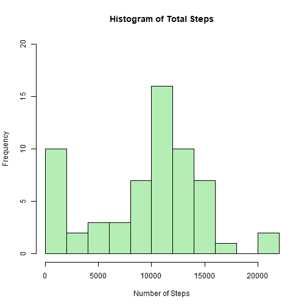
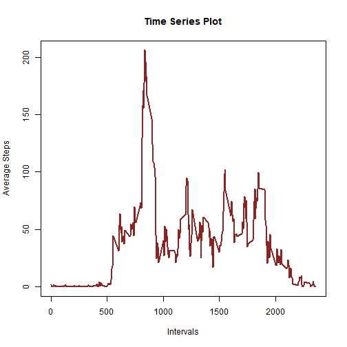
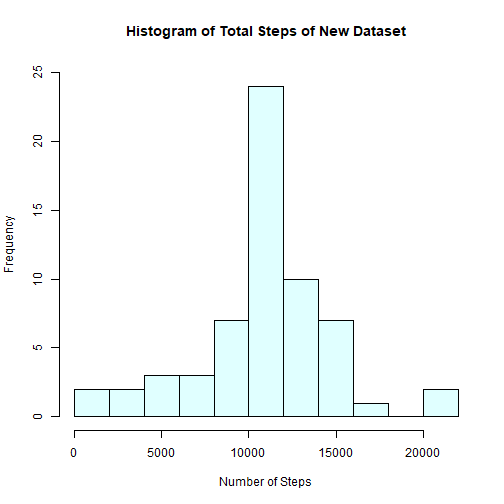
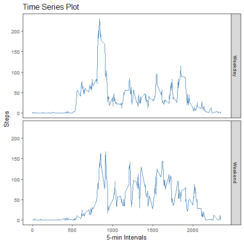

Course 5 Project 1
=============================================================================================================

## INTRODUCTION
It is now possible to collect a large amount of data about personal movement using activity monitoring devices such as a Fitbit, Nike Fuelband, or Jawbone Up. These type of devices are part of the “quantified self” movement – a group of enthusiasts who take measurements about themselves regularly to improve their health, to find patterns in their behavior, or because they are tech geeks. But these data remain under-utilized both because the raw data are hard to obtain and there is a lack of statistical methods and software for processing and interpreting the data.  

This assignment makes use of data from a personal activity monitoring device. This device collects data at 5 minute intervals through out the day. The data consists of two months of data from an anonymous individual collected during the months of October and November, 2012 and include the number of steps taken in 5 minute intervals each day.  

The variables included in this dataset are:-  
* **Steps** : Number of steps taking in a 5-minute interval (missing values are coded as NA)  
* **Date** : The date on which the measurement was taken in YYYY-MM-DD format  
* **interval** : Identifier for the 5-minute interval in which measurement was taken  

### Reading and preprocessing the data

The data is stored in a csv file. Let's read the data by using the following code:


```r
dta <- read.csv("activity.csv")
```

Now let's get to know our data:

```r
summary(dta)
```

```
##      steps            date              interval     
##  Min.   :  0.00   Length:17568       Min.   :   0.0  
##  1st Qu.:  0.00   Class :character   1st Qu.: 588.8  
##  Median :  0.00   Mode  :character   Median :1177.5  
##  Mean   : 37.38                      Mean   :1177.5  
##  3rd Qu.: 12.00                      3rd Qu.:1766.2  
##  Max.   :806.00                      Max.   :2355.0  
##  NA's   :2304
```

The date object is of class character, so let's convert it into date first:

```r
dta$date <- as.Date(dta$date)
```

### What is mean total number of steps taken per day?

#### 1. Calculate the total number of steps taken per day
For this, we will use the tapply function that will coerce date into factor and calculate the total number of steps for each day. The code used to do that is:-

```r
total_steps <- tapply(dta$steps, dta$date, sum, na.rm=T)
```

#### 2.If you do not understand the difference between a histogram and a barplot, research the difference between them. Make a histogram of the total number of steps taken each day
The hist function will be used for this part. The code is:-

```r
hist(total_steps, main = "Histogram of Total Steps", col = "darkseagreen2", breaks = 8, xlab = "Number of Steps", ylim = c(0,20))
```



#### 3.Calculate and report the mean and median of the total number of steps taken per day
The mean of the total number of steps can be calculated by:-

```r
mean(total_steps)
```

```
## [1] 9354.23
```
The median can be calculated by:-

```r
median(total_steps)
```

```
## [1] 10395
```


### What is the average daily activity pattern?  

#### 1. Make a time series plot (i.e. type = “l”) of the 5-minute interval (x-axis) and the average number of steps taken, averaged across all days (y-axis)  


```r
#Making a list with names as intervals and values as the average of steps for that interval for all days
avg_steps <- tapply(dta$steps, dta$interval, mean, na.rm=TRUE)

#Plotting
plot(as.numeric(names(avg_steps)), avg_steps, xlab = 'Intervals', ylab = 'Average Steps', main = "Time Series Plot", type = 'l', col = "brown4", lwd=2)
```



#### 2. Which 5-minute interval, on average across all the days in the dataset, contains the maximum number of steps?  

```r
as.numeric(names(avg_steps)[avg_steps == max(avg_steps)])
```

```
## [1] 835
```

### Imputing Missing Values
Note that there are a number of days/intervals where there are missing values (coded as NA). The presence of missing days may introduce bias into some calculations or summaries of the data.  

#### 1. Calculate and report the total number of missing values in the dataset (i.e. the total number of rows with NAs)

The is.na function returns a logical vector where every value that is NA becomes TRUE and others become false. The total number of true values can be counted for finding he number of NA values.  

```r
sum(is.na(dta$steps))
```

```
## [1] 2304
```

#### 2. Devise a strategy for filling in all of the missing values in the dataset. The strategy does not need to be sophisticated. For example, you could use the mean/median for that day, or the mean for that 5-minute interval, etc.  
The strategy would be using nested while loops to replace all the NA values with the mean of all days for that interval.
The outer loop will run for all row indices of data set, that is 17568 times. But the mean values are available only for 288 entries because in total, there are only 288 intervals. Inner while loop will run 288 times and will reset to 1 after 288. Every index containing NA values will be replaces by the corresponding interval mean from avg_steps data.  

#### 3. Create a new dataset that is equal to the original dataset but with the missing data filled in.
The new dataset will be new_dta.  
Here we replace all the NA values by the mean of all days for that interval after copying.  

```r
#Copying current data set into new data set
new_dta <- data.frame(steps = dta$steps, date = dta$date, interval = dta$interval)

#Replacing the NA values
x = 1
while(x<=17568)
{
     y=1
     while(y<=288)
     {
         if(is.na(dta$steps[x]))
         {
             new_dta$steps[x] <- avg_steps[y]
         }
         x<-x+1
         y<-y+1
     }
}
```
  
#### 4. Make a histogram of the total number of steps taken each day and Calculate and report the mean and median total number of steps taken per day. Do these values differ from the estimates from the first part of the assignment? What is the impact of imputing missing data on the estimates of the total daily number of steps?

```r
#convertings date column into factor
new_dta$date = as.Date(new_dta$date)

#Finding total number of steps for each day
total_steps_new = tapply(new_dta$steps, new_dta$date, sum)

#creating the histogram
hist(total_steps_new, main = "Histogram of Total Steps of New Dataset", col = "lightcyan", breaks = 8, xlab = "Number of Steps", ylim = c(0,25))
```



```r
#Finding mean total number of steps
mean(total_steps_new)
```

```
## [1] 10766.19
```

```r
#Finding median total number of steps
median(total_steps_new)
```

```
## [1] 10766.19
```

### Are there differences in activity patterns between weekdays and weekends?
For this part the weekdays() function may be of some help here. Use the dataset with the filled-in missing values for this part.  

#### 1. Create a new factor variable in the dataset with two levels – “weekday” and “weekend” indicating whether a given date is a weekday or weekend day.

```r
#Making the new variable
new_column <- sapply(as.Date(new_dta$date), function(date)
                                            {if (weekdays(date)=="Saturday" | weekdays(date)=="Sunday")
                                                  new_column <- "Weekend"
                                            else
                                                  new_column <- "Weekday"
                                            })
#Adding the new variable to dataset
new_dta <- cbind(new_dta, new_column)
```

#### 2. Make a panel plot containing a time series plot (i.e. type = "l") of the 5-minute interval (x-axis) and the average number of steps taken, averaged across all weekday days or weekend days (y-axis). See the README file in the GitHub repository to see an example of what this plot should look like using simulated data.

```r
#Making a dataset with average of daily steps for each interval based on weekdays and weekends.
dat<- aggregate(steps~interval+new_column, new_dta, mean, na.rm=TRUE)

#Loading package
library(ggplot2)
```

```
## RStudio Community is a great place to get help: https://community.rstudio.com/c/tidyverse
```

```r
#Creating the plot
g <- ggplot(dat, aes(interval, steps))
g+facet_grid(new_column~.) + geom_line(color = "steelblue") + theme_test(base_size = 13) + labs(title = "Time Series Plot", x = "5-min Intervals", y = "Steps")
```



